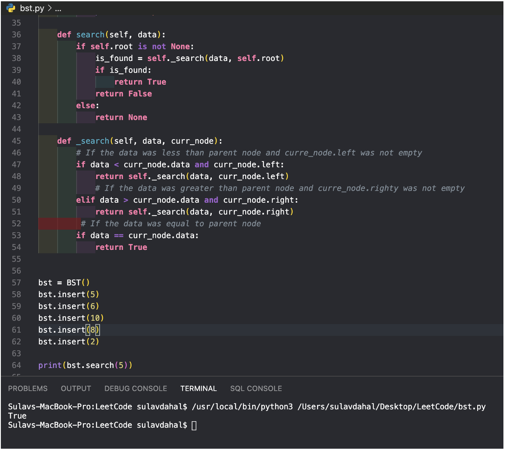
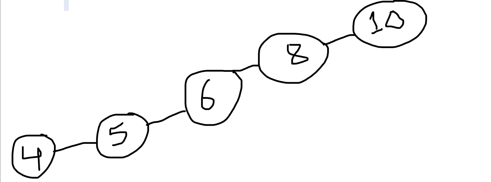

# Tree 🌲

After we've looked at linear data structures like stacks and linked lists, we'll take a peek at a popular data structure called the tree. Tree Data Structures, as the name suggests, have a base, branches, and leaves. The only distinction between a real-world tree and a tree data structure is that a tree data structure has its base at the top and its leaves at the bottom. Before we begin, it is important to understand that a tree is called a hierarchical tree. By hierarchical, we say that trees are arranged in layers, with more general information at the top and more detailed information at the bottom. Let's take a peek at the file system hierarchy.

We start at the top and follow path made up of folder till the end. Each folder is also called Node and we can say right off the bat the leaves are (bin, usr, etc., lib, student, Jon, Steve). The path between the root of the tree and its leaves are called branches, and the height of the tree is the length of its longest branch. So, if I want to go to the folder Jon, I will start at the root/users/admin/Jan.

With the basic Idea of trees, lets shift our gear to Binary Search Trees and see how it works and how it implements the CRUD operation like the Linked List. There are many trees structure like binary search trees, heaps and tries however we will be focusing on binary search trees.

### Binary Search Tree 𐂷

A BST follows a data that keys less than the parent node are found in the left subtree, and the keys that are greater than parent are found in the right sub tree. A binary search tree must have at most two children. This property is also known as bst property.

Using the tree we can determine where we want to put the new value. So, basically we compare it with the parent value and if the new value is less than the parent value it is going to be in the left sub-tree. Similarly, if the new value is greater than the parent value it is going to be in the right sub-tree. We keeping comparing until we have found the empty space. With that being said, now let’s see how can we insert in the Binary Search Tree using Python .

Now, let’s see how we can search for a particular value.

### Balanced Binary Search Tree 𖢞:

Suppose we have an array of items like 10,8,6,5,4, Now we want to implement a binary search tree over here. Let’s create a diagram and see how it will look like in the BST diagram.

It looks like we have seen this diagram before and if we want to search the item in the worst case it will be O(n) i.e a linear search. Now, it completely changes the dynamic of Binary search tree pattern. There are some common algorithms to balanced a binary tree and one of them is AVL tree and is named for its inventory: GM. Adelson-Velski and EM Landis. They say that, we can define a balanced factor for a node if the difference between the height of the left subtree and the height of the right subtree.

Balanced = heigh(leftSubTree) – height(rightSubTree)

Find the height of a BST: Let me explain how the below algorithm is working

| Node | Left-Sub-Tree | Right-Sub-Tree |
| ---- | ------------- | -------------- |
| 1    | 2             | 2              |
| 2    | 1             | 1              |
| 4    | 0             |

We have a base case when the curr_node is null we return -1
So the maximum + 1 would return 0 in the leaf.

Now, we do a recursive call to the nodes and keep looking the left and right value and return the height from the node.

