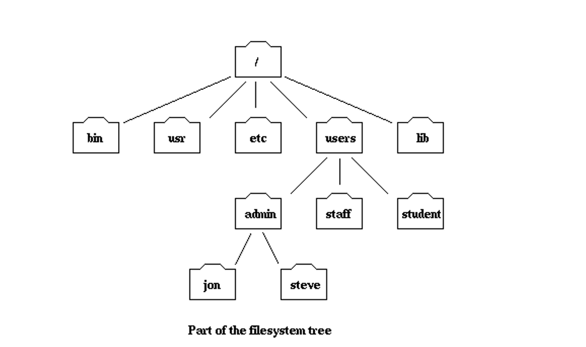
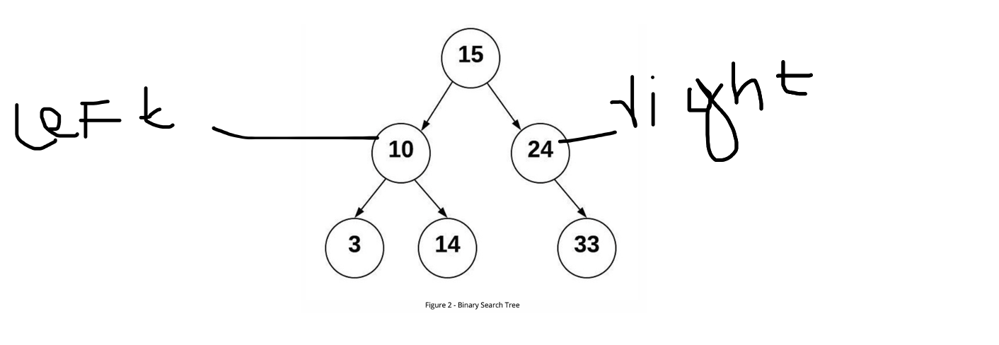
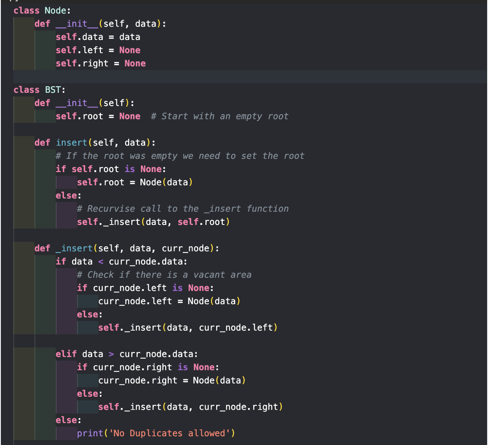
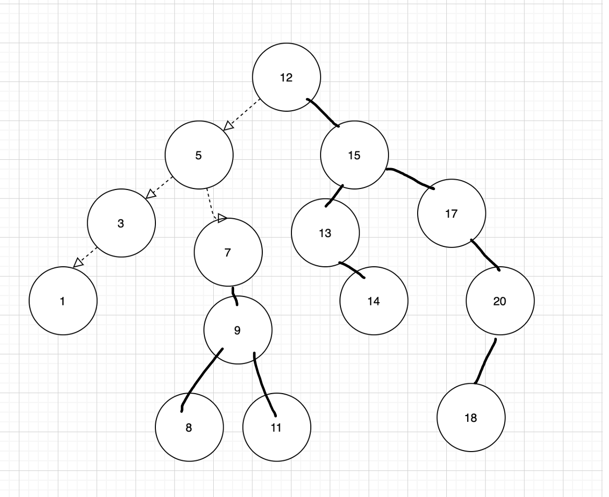

# Tree 🌲

After we've looked at linear data structures like stacks and linked lists, we'll take a peek at a popular data structure called the tree. Tree Data Structures, as the name suggests, have a base, branches, and leaves. The only distinction between a real-world tree and a tree data structure is that a tree data structure has its base at the top and its leaves at the bottom. Before we begin, it is important to understand that a tree is called a hierarchical tree. By hierarchical, we say that trees are arranged in layers, with more general information at the top and more detailed information at the bottom. Let's take a peek at the file system hierarchy.

We start at the top and follow path made up of folder till the end. Each folder is also called Node and we can say right off the bat the leaves are (bin, usr, etc., lib, student, Jon, Steve). The path between the root of the tree and its leaves are called branches, and the height of the tree is the length of its longest branch. So, if I want to go to the folder Jon, I will start at the root/users/admin/Jan.

With the basic Idea of trees, lets shift our gear to Binary Search Trees and see how it works and how it implements the CRUD operation like the Linked List. There are many trees structure like binary search trees, heaps and tries however we will be focusing on binary search trees.

### Tree Traversal

There are some patterns that we use in trees to traverse. These usage patterns can be divided into the three ways that we access the nodes of the tree. The difference between these patterns is the order in which each node is visited. The three traversal are called preoder, inorder, and postorder. Let's now demistify what these three orders are:

> \*Note Left subtree tree is always visited before right subtree, and only the position changes in these three different Traversal Method.

1. Pre-order: Root -> Left -> Right. In this traversal method we visit the root node first, then go though all the left subtree and then visit the right subtree
2. In-order: Left -> Root -> Right. In this traversal method, we visit the left subtree first, visit the root node and finally the right subtree
3. Post-order: Left -> Right -> Root. In this traversal method, we visit left subtree, right subtree followed by the visit of the root node.

##### Facts about Binary Search Tree

Here are some facts about binary search tree that maybe helpful for you people.

> 1. Inorder Traversal of BST is an array sorted in the ascending order.
> 2. Successor means after node i.e the next node, or the smallest node after the current node. In order to find the successor we go once to the right and then as many time as left as we possibily can.
> 3. Predecessor means before node i.e the previous node, or the largest node before the current. In order to find the predecessor we go once to the left and then as many time as right as we possibily can.

### Binary Search Tree 𐂷

A BST follows a data that keys less than the parent node are found in the left subtree, and the keys that are greater than parent are found in the right sub tree. A binary search tree must have at most two children. This property is also known as bst property.

Using the tree we can determine where we want to put the new value. So, basically we compare it with the parent value and if the new value is less than the parent value it is going to be in the left sub-tree. Similarly, if the new value is greater than the parent value it is going to be in the right sub-tree. We keeping comparing until we have found the empty space. With that being said, now let’s see how can we insert in the Binary Search Tree using Python .

Now, let’s see how we can search for a particular value.

### Balanced Binary Search Tree 𖢞:

Suppose we have an array of items like 10,8,6,5,4, Now we want to implement a binary search tree over here. Let’s create a diagram and see how it will look like in the BST diagram.

It looks like we have seen this diagram before and if we want to search the item in the worst case it will be O(n) i.e a linear search. Now, it completely changes the dynamic of Binary search tree pattern. There are some common algorithms to balanced a binary tree and one of them is AVL tree and is named for its inventory: GM. Adelson-Velski and EM Landis. They say that, we can define a balanced factor for a node if the difference between the height of the left subtree and the height of the right subtree.

Balanced = heigh(leftSubTree) – height(rightSubTree)

Find the height of a BST: Let me explain how the below algorithm is working

| Node | Left-Sub-Tree | Right-Sub-Tree |
| ---- | ------------- | -------------- |
| 1    | 2             | 2              |
| 2    | 1             | 1              |
| 4    | 0             |

We have a base case when the curr_node is null we return -1
So the maximum + 1 would return 0 in the leaf.

Now, we do a recursive call to the nodes and keep looking the left and right value and return the height from the node.

#### Deletion in a Binary Search Tree

Deletion is a bit complicated and there are way more strategies to delete a particular. The solution that we are going to talk here is about replacing the targeted the node with proper child. There are three diferrent cases that we need to consider before deleting a node in a binary search Tree.

> 1. If the targeted node has no child, we can simply remove the node.
> 2. If the targeted node has one child, we can use its child to replace itself.
> 3. If the targeted node has two child, check if the node has right child, then find minimum from that right subtree, replace the node with the minimum value and delet the minimum value which was found. Similarly, if the node has left chidl, then find maximum fro the left subtree, replace the node.value with the maximum value and delete the maximum value which was found.

Algorithm:

    1. Check if the input > root.value, then the node to be deleted should be in the right-subtree.
    2. Check if the input < root.value, then the node to be deleted should be in the left-subtree.
    3. if the input == root.value, ahaa momemt , use you three cases:
        a. if the node is the leaf, then our life is easier we just write root.val = null
        b. If the node has no leaf, has the left child, the we find the maximum value from the left-subtree i.e Predecessor and recursively delete the value in the left subtree.
        c. If the node has no leaf, has the right child, then we find the minimum value from the right-subtree i.e Successor and recursively delete the value value in the right subtree.

Try on you own, with the help of the above algorithm. Like always, if you can't solve it here is the solution for the problem.

[Solution_deletion_bst](./solution_deletion_bst.md)

Binary Search Tree Standard Operations:

| S.n | Binary Search Tree          |
| --- | --------------------------- |
| 1   | Insertion : O(log n)        |
| 2   | Remove : O(log n)           |
| 4   | Contains: O (log n)         |
| 5   | Traverse Forward : O(log n) |
| 6   | Traverse Reverse: O (log n) |
| 7   | Height: O(log n )           |
| 8   | Size: O(1)                  |
| 9   | Empty: O(1)                 |
