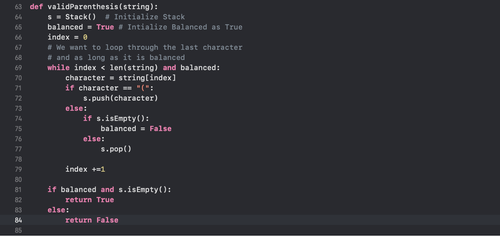

** Draft 1 **

# Stacks 📚

A stack, also known as a (push-down) stack, is an organized array of items in which new items are inserted and old items are removed at the same end. The end is generally referred to as the "top," and the opposite end is referred to as the "base." The component that was most recently inserted is the one that is most likely to be replaced first. This principle is also known as LIFO (Last in First out). The newest products are at the top, while the older ones are at the bottom. And if we are just talking about stacks now, we have been acquainted with the idea of a stack for a long time. For instance, suppose we have a stack of plates in our house, and we take the plates at the top, right? Provided that we are learning computer science, let us look at an example that makes more sense to us. Consider a collection of programming languages. To obtain access to the other programming languages in the stack, we must first delete the one at the end. The stack of programming languages is represented in the diagram.

One of the most useful useful ideas are related to stacks comes from the simple observation of items as they added and then removed. The order that they are removed is exactly the reverse of the order that they were placed. Stakcls are crucial, as they can be used to reverse the order of items as well.

### The Stack Abstract Data Type

We axn define the stack abstract data type by structure and operations. The stack opertaions are given below:

1. Stack() - Creates a new stack that is empty. It needs no parameters and returns an empty stack
2. Push(items) - Adds a new item to the top of the stack. It needs the item and returns nothing.
3. Peek() - Returns the top item of the stack but doesn’t remove it. It needs no parameters. The stack is not modified.
4. isEmpty() - tests to see whether the stack is empty. It needs no parameters as well and returns a Boolean value.
5. Size() - – returns the number of items on the stack. It needs no parameters and returns an integer.

##### With all this knowledge covered let's test how we can implement the stack interface

```
class Stack:
    def __init__(self):
        self.items=[]

    def isEmpty(self):
        return self.items==[]

    def push(self,item):
        self.items.append(item)

    def peek(self):
        return self.items[len(self.items)-1]

    def size(self):
        return len(self.items)

s = Stack()
s.isEmpty()
# True

s.push(4)
s.push('Python Language')
s.peek()

# returns Python Language

s.push('C++')
s.size()

# returns 3

s.isEmpty()
#returns False
```

##### We care a lot about algorithm and efficiencny so here is the stack's standard operations to their corresponding time complexities

- PushingO(1)
- PoppingO(1)
- PeekingO(1)
- Searching O(n) - because we have to go throught each of it in a linear way

##### \*Note a stack is implemented with a dynamic array or with a linked List

Now, enough talking about its implementation, how it looks and how it works, let’s try some hands on experience with real world example, sounds exciting right 🤘?

Given a string containing just the characters determine if the input string is valid:

1. Open bracket must be closed in the correct order

For example. ( () ( () ) () )

Let me help you to solve this question and see how can we use stack to solve questions like this using stack

> The task here is to create an algorithm that reads a string of parenthesis from left to right and determines if the symbols are balanced. Closing symbols correspond to opening symbols in the opposite order of presentation. This provides proof that stacks can be used to solve the dilemma.

> Starting with an empty stack, we need to process the parenthesis, push it on the stack as a signal that a corresponding closing symbol needs to appear later. If we see a closing parenthesis, we are going to pop the stack. Now, as long as it is possible top pop the stack to match every closing symbol, the parenthesis remains balanced. If there is no closing parenthesis or vice, we now know that it is not balanced and will return false. At the end of the string when all symbols have been processed, the stack should be empty right? Let’s use python to see how this would look in the code



Now, its your turn to solve a problem similar to the question above instead of checking for the just a paranthesis in the upcoming problem you are going to check for other symbols as well.

Given a string containing the mixture of charaters determine if the input string is valid.

1. Open bracket must be closed in the correct order for the string to be valid.

For example: ([)]
Example 2: {{([][])}}

[Solution for the Problem ](./solution_valid_mixture.md)
