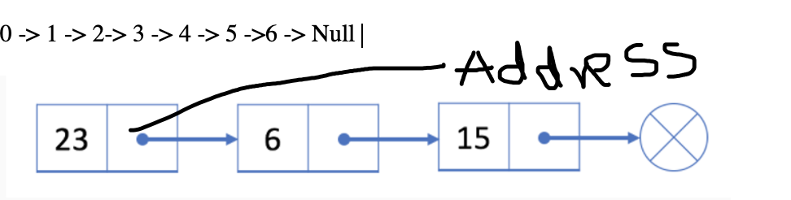
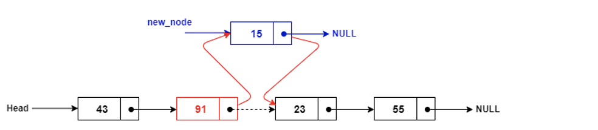
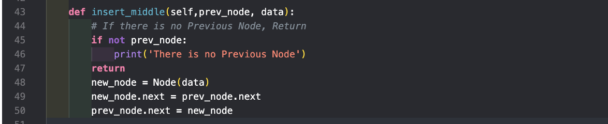

** Draft 1 **

# Stacks 📚

A stack, also known as a (push-down) stack, is an organized array of items in which new items are inserted and old items are removed at the same end. The end is generally referred to as the "top," and the opposite end is referred to as the "base." The component that was most recently inserted is the one that is most likely to be replaced first. This principle is also known as LIFO (Last in First out). The newest products are at the top, while the older ones are at the bottom. And if we are just talking about stacks now, we have been acquainted with the idea of a stack for a long time. For instance, suppose we have a stack of plates in our house, and we take the plates at the top, right? Provided that we are learning computer science, let us look at an example that makes more sense to us. Consider a collection of programming languages. To obtain access to the other programming languages in the stack, we must first delete the one at the end. The stack of programming languages is represented in the diagram.

One of the most useful useful ideas are related to stacks comes from the simple observation of items as they added and then removed. The order that they are removed is exactly the reverse of the order that they were placed. Stakcls are crucial, as they can be used to reverse the order of items as well.

### The Stack Abstract Data Type

We axn define the stack abstract data type by structure and operations. The stack opertaions are given below:

1. Stack() - Creates a new stack that is empty. It needs no parameters and returns an empty stack
2. Push(items) - Adds a new item to the top of the stack. It needs the item and returns nothing.
3. Peek() - Returns the top item of the stack but doesn’t remove it. It needs no parameters. The stack is not modified.
4. isEmpty() - tests to see whether the stack is empty. It needs no parameters as well and returns a Boolean value.
5. Size() - – returns the number of items on the stack. It needs no parameters and returns an integer.

##### With all this knowledge covered let's test how we can implement the stack interface

```
class Stack:
    def __init__(self):
        self.items=[]

    def isEmpty(self):
        return self.items==[]

    def push(self,item):
        self.items.append(item)

    def peek(self):
        return self.items[len(self.items)-1]

    def size(self):
        return len(self.items)

s = Stack()
s.isEmpty()
# True

s.push(4)
s.push('Python Language')
s.peek()

# returns Python Language

s.push('C++')
s.size()

# returns 3

s.isEmpty()
#returns False
```

##### We care a lot about algorithm and efficiencny so here is the stack's standard operations to their corresponding time complexities

- PushingO(1)
- PoppingO(1)
- PeekingO(1)
- Searching O(n) - because we have to go throught each of it in a linear way

##### \*Note a stack is implemented with a dynamic array or with a linked List

Now, enough talking about its implementation, how it looks and how it works, let’s try some hands on experience with real world example, sounds exciting right 🤘?

Given a string containing just the characters determine if the input string is valid:

1. Open bracket must be closed in the correct order

For example. ( () ( () ) () )

Let me help you to solve this question and see how can we use stack to solve questions like this using stack

> The task here is to create an algorithm that reads a string of parenthesis from left to right and determines if the symbols are balanced. Closing symbols correspond to opening symbols in the opposite order of presentation. This provides proof that stacks can be used to solve the dilemma.

> Starting with an empty stack, we need to process the parenthesis, push it on the stack as a signal that a corresponding closing symbol needs to appear later. If we see a closing parenthesis, we are going to pop the stack. Now, as long as it is possible top pop the stack to match every closing symbol, the parenthesis remains balanced. If there is no closing parenthesis or vice, we now know that it is not balanced and will return false. At the end of the string when all symbols have been processed, the stack should be empty right? Let’s use python to see how this would look in the code


# Linked List 🖇

We have watched many treasure hunting movies like Pirates of Caribbean or played games like Tomb Raider, Linked List is similar to treasure hunt, so you go to the first item and it says the location of second item can be found in this address, you again to other item and it again says you can find the location of other item in this address, we go like this until we have reached the end. With linked lists, our item can be anywhere in memory. Each item stores the address of the next item in the list. Importantly, in array if have to add an item in middle or front we would have to shift all the items. With linked lists, we don’t have to move our items.

> 0 -> 1 -> 2-> 3 -> 4 -> 5 ->6 -> Null



The Node object holds two pieces of information. First, the node must contain the list item itself i.e data and second, it must hold a reference to the next node. In the linked list world, we refer the first node as head of the linked list and the null as the tail. A reference to Null or None implies that there is no next node.

> With all this information let’s see how we can perform CRUD (Create, Read, Update and Delete) Operation in the linked list.

### Insertion and Traverse

#### Steps to insert:

1. Check whether the List is empty or not. If yes than we want to make that first data head
2. If the list is not empty check where the next pointer leads to null and append the data in the list .

```
    """
        Create a Linked list
    """

class Node:
    def __init__(self, data):
        self.data = data
        self.next = None  # Memory addrees that we are talking about


class LinkedList:
    def __init__(self):
        self.head = None  # Empty Linked List

    def print_list(self):
        curr_node = self.head
        # Traverse the List until we hit the end
        while curr_node is not None:
            print(curr_node.data)
            curr_node = curr_node.next

    def append(self, data):
        # Check if the List is empty
        new_node = Node(data)
        if self.head == None:
            self.head = new_node
            return
        # Point Initially to Head
        last_node = self.head
        # While the next pointer of the Node is not Null
        # We Keep Traversing

        while last_node.next is not None:
            last_node = last_node.next
        last_node.next = new_node

list1 = LinkedList()
list1.append("Treasure")
list1.append("Hunting")
list1.append("is Awesome")
list1.prepend("Ring")
list1.print_list()
```

### Insert at the beginning of the List

Let’s say now instead of inserting at the end we want to insert at the beginning i.e prepend it. Okay, sounds exciting but how to do right? Well, in order to prepend what we just need to do is that make next pointer of the new node to connect to the head and change the head to the new node. What are you saying? new node and blah blah. Well, let me show you the code, if you were thinking like that

```
    # Code example to insert at the beginning
    def prepend(self, data):
        new_node = Node(data)
        new_node.next = self.head
        self.head = new_node

```

Have a look at the prepend method. We initializing new node.next (pointer) to head of the list and changing the head to be new head. I hope that makes sense. There are some people who likes to jump in the middle of the talk and start talking and talking. Well, it turns out that we can also insert a node in the middle. Let’s see how can we insert in the middle. There are some things that we have to keep in our mind before we ought to insert in the middle.



1. The next pointer of new_node should point to the next of the previous pointer as you can see in the picture. Doing so, we have the new_node and the prev_node point to the same next pointer.

2. Now, we have to change the next pointer of previous to the new_node. Doing this, the next pointer of previous.node will point to the new_node and we can insert in the middle.



Now, enough talking about insertion let’s talk about how we can delete a particular node.

### Delete a Node in the Linked List

In order to delete a Node we will have to keep track of few things. If we want to delete


Somewhere where it is not head, we have to make the previous node point to the next of the current node. It’s like disconnecting a wire if we disconnect it we delete that particular node. For instance, in the above picture if we want to delete the data C, we are going to point the Previous Node to the next of the current Node i.e., D. and Set the current Node = None.

```
    def delete_node(self, data):
        # Case 1: If the data to be deleted was head
        curr_node = self.head
        while curr_node and curr_node.data == data:
            self.head = curr_node.next
            curr_node = None
            return

        # Case 2: If the data to be deleted is somewhere in the list
        prev = None
        while curr_node and curr_node.data != data:
            prev = curr_node
            curr_node = curr_node.next

        if curr_node is None:
            # The Item couldn't be found
            return
        prev.next = curr_node.next
        curr_node = None

```

Let’s see the linked list standard operations:

1. Insertion: O(1)
2. Deletion: O(1)
3. Searching: O(n)

# Tree 🌲

After we've looked at linear data structures like stacks and linked lists, we'll take a peek at a popular data structure called the tree. Tree Data Structures, as the name suggests, have a base, branches, and leaves. The only distinction between a real-world tree and a tree data structure is that a tree data structure has its base at the top and its leaves at the bottom. Before we begin, it is important to understand that a tree is called a hierarchical tree. By hierarchical, we say that trees are arranged in layers, with more general information at the top and more detailed information at the bottom. Let's take a peek at the file system hierarchy.


We start at the top and follow path made up of folder till the end. Each folder is also called Node and we can say right off the bat the leaves are (bin, usr, etc., lib, student, Jon, Steve). The path between the root of the tree and its leaves are called branches, and the height of the tree is the length of its longest branch. So, if I want to go to the folder Jon, I will start at the root/users/admin/Jan.

With the basic Idea of trees, lets shift our gear to Binary Search Trees and see how it works and how it implements the CRUD operation like the Linked List. There are many trees structure like binary search trees, heaps and tries however we will be focusing on binary search trees.

### Binary Search Tree 𐂷

A BST follows a data that keys less than the parent node are found in the left subtree, and the keys that are greater than parent are found in the right sub tree. A binary search tree must have at most two children. This property is also known as bst property.


Using the tree we can determine where we want to put the new value. So, basically we compare it with the parent value and if the new value is less than the parent value it is going to be in the left sub-tree. Similarly, if the new value is greater than the parent value it is going to be in the right sub-tree. We keeping comparing until we have found the empty space. With that being said, now let’s see how can we insert in the Binary Search Tree using Python .


Now, let’s see how we can search for a particular value.


### Balanced Binary Search Tree 𖢞:

Suppose we have an array of items like 10,8,6,5,4, Now we want to implement a binary search tree over here. Let’s create a diagram and see how it will look like in the BST diagram.


It looks like we have seen this diagram before and if we want to search the item in the worst case it will be O(n) i.e a linear search. Now, it completely changes the dynamic of Binary search tree pattern. There are some common algorithms to balanced a binary tree and one of them is AVL tree and is named for its inventory: GM. Adelson-Velski and EM Landis. They say that, we can define a balanced factor for a node if the difference between the height of the left subtree and the height of the right subtree.

Balanced = heigh(leftSubTree) – height(rightSubTree)

Find the height of a BST: Let me explain how the below algorithm is working


| Node | Left-Sub-Tree | Right-Sub-Tree |
| ---- | ------------- | -------------- |
| 1    | 2             | 2              |
| 2    | 1             | 1              |
| 4    | 0             |

We have a base case when the curr_node is null we return -1
So the maximum + 1 would return 0 in the leaf.

Now, we do a recursive call to the nodes and keep looking the left and right value and return the height from the node.


