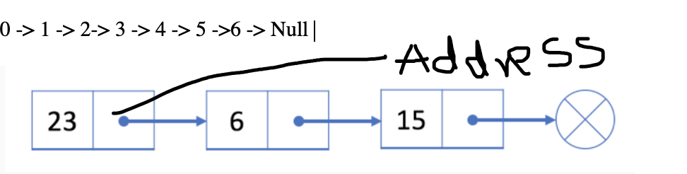
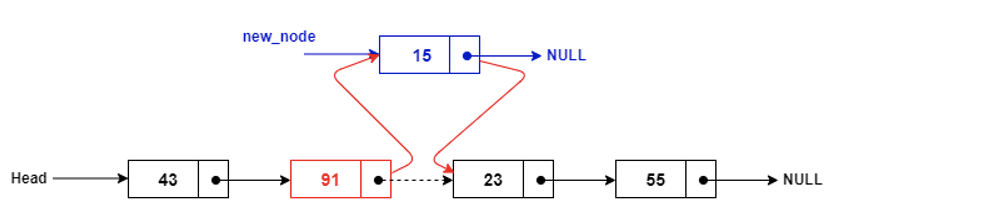
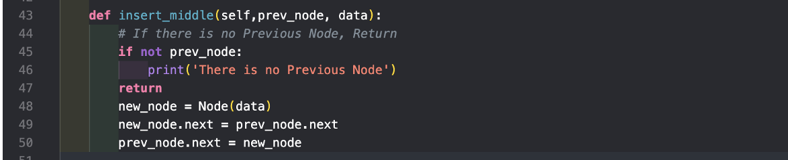
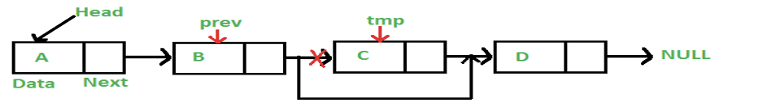

# Linked List 🖇

We have watched many treasure hunting movies like Pirates of Caribbean or played games like Tomb Raider, Linked List is similar to treasure hunt, so you go to the first item and it says the location of second item can be found in this address, you again to other item and it again says you can find the location of other item in this address, we go like this until we have reached the end. With linked lists, our item can be anywhere in memory. Each item stores the address of the next item in the list. Importantly, in array if have to add an item in middle or front we would have to shift all the items. With linked lists, we don’t have to move our items.

> 0 -> 1 -> 2-> 3 -> 4 -> 5 ->6 -> Null



The Node object holds two pieces of information. First, the node must contain the list item itself i.e data and second, it must hold a reference to the next node. In the linked list world, we refer the first node as head of the linked list and the null as the tail. A reference to Null or None implies that there is no next node.

> With all this information let’s see how we can perform CRUD (Create, Read, Update and Delete) Operation in the linked list.

### Insertion and Traverse

#### Steps to insert:

1. Check whether the List is empty or not. If yes than we want to make that first data head
2. If the list is not empty check where the next pointer leads to null and append the data in the list .

```
    """
        Create a Linked list
    """

class Node:
    def __init__(self, data):
        self.data = data
        self.next = None  # Memory addrees that we are talking about


class LinkedList:
    def __init__(self):
        self.head = None  # Empty Linked List

    def print_list(self):
        curr_node = self.head
        # Traverse the List until we hit the end
        while curr_node is not None:
            print(curr_node.data)
            curr_node = curr_node.next

    def append(self, data):
        # Check if the List is empty
        new_node = Node(data)
        if self.head == None:
            self.head = new_node
            return
        # Point Initially to Head
        last_node = self.head
        # While the next pointer of the Node is not Null
        # We Keep Traversing

        while last_node.next is not None:
            last_node = last_node.next
        last_node.next = new_node

list1 = LinkedList()
list1.append("Treasure")
list1.append("Hunting")
list1.append("is Awesome")
list1.prepend("Ring")
list1.print_list()
```

### Insert at the beginning of the List

Let’s say now instead of inserting at the end we want to insert at the beginning i.e prepend it. Okay, sounds exciting but how to do right? Well, in order to prepend what we just need to do is that make next pointer of the new node to connect to the head and change the head to the new node. What are you saying? new node and blah blah. Well, let me show you the code, if you were thinking like that

```
    # Code example to insert at the beginning
    def prepend(self, data):
        new_node = Node(data)
        new_node.next = self.head
        self.head = new_node

```

Have a look at the prepend method. We initializing new node.next (pointer) to head of the list and changing the head to be new head. I hope that makes sense. There are some people who likes to jump in the middle of the talk and start talking and talking. Well, it turns out that we can also insert a node in the middle. Let’s see how can we insert in the middle. There are some things that we have to keep in our mind before we ought to insert in the middle.



1. The next pointer of new_node should point to the next of the previous pointer as you can see in the picture. Doing so, we have the new_node and the prev_node point to the same next pointer.

2. Now, we have to change the next pointer of previous to the new_node. Doing this, the next pointer of previous.node will point to the new_node and we can insert in the middle.



Now, enough talking about insertion let’s talk about how we can delete a particular node.

### Delete a Node in the Linked List

In order to delete a Node we will have to keep track of few things. If we want to delete



Somewhere where it is not head, we have to make the previous node point to the next of the current node. It’s like disconnecting a wire if we disconnect it we delete that particular node. For instance, in the above picture if we want to delete the data C, we are going to point the Previous Node to the next of the current Node i.e., D. and Set the current Node = None.

```
    def delete_node(self, data):
        # Case 1: If the data to be deleted was head
        curr_node = self.head
        while curr_node and curr_node.data == data:
            self.head = curr_node.next
            curr_node = None
            return

        # Case 2: If the data to be deleted is somewhere in the list
        prev = None
        while curr_node and curr_node.data != data:
            prev = curr_node
            curr_node = curr_node.next

        if curr_node is None:
            # The Item couldn't be found
            return
        prev.next = curr_node.next
        curr_node = None

```

Let’s see the linked list standard operations:

1. Insertion: O(1)
2. Deletion: O(1)
3. Searching: O(n)

Well we have covered everything needed now let's change our gear and try a classic problem which is to reverse a Linked List

```
    """
    Given the list, reverse the List and return the reversed List
    Example1.
    1 -> 2-> 3-> 4-> 5 (Input)
    5 -> 4 -> 3 -> 2 -> 1 (Output)

    Algorithm:
        Iterative
        From the given list we can change it to 0 <- 1 <-2 <-3 <-4  <-5
        While we travese the list, we are going to change the current node's next pointer to its previous element. Note* , Since a node doesn't have a reference to previous node, we must store as null before starting. We also need another pointer to store the next node.

        We use a temporary variable temp to point towards the next node of the head node and also link the next field of the temp.
    """
    def reverse_list(self,data):
        prev = None
        curr_node = self.head

        while curr_node not None:
            temp = curr_node.next
            curr_node.next = self.prev
            self.prev = self.curr_node
            self.curr_node = temp
        return self.prev

```
