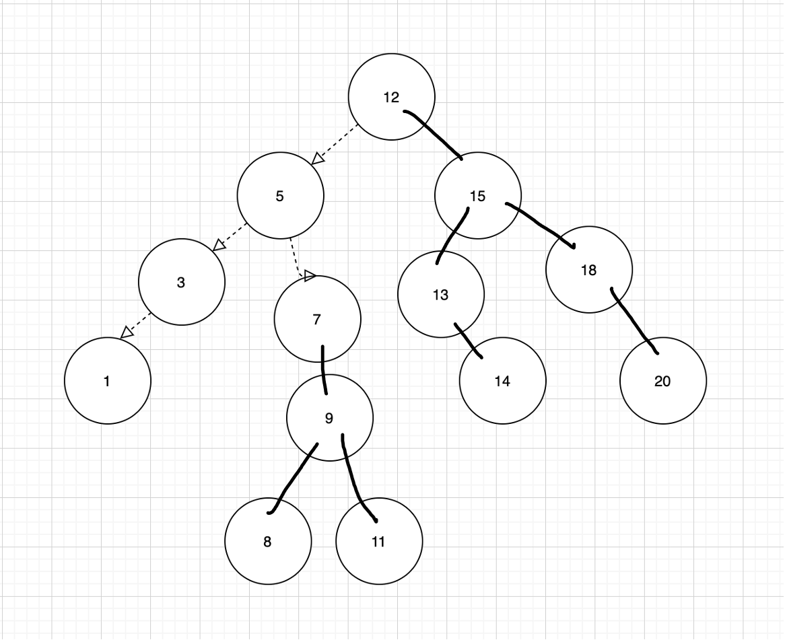

Code Walkthrough:

This is what is should look like After we are done.


```
class BST:

    def find_min_in_right_sub_tree(self, root):
        // Successor
        # Once right and go always left

        root = root.right
        while root.left :
            root = root.left
        return root.value


    def find_max_in_left_sub_tree(self,root):

        # Once left and go always right
        root = root.left
        while root.right:
            root = root.right
        return root.value


    def delete_node(self, root, input):
        if not root:
            return None

        # Delete from the right-subtree
        if input > root.value:
            root.right = self.delete_node(root.right, input)

        # Delete from the left-subtree
        if input < root.value:
            root.left  = self.delete_node(root.left, input)

        # we found the input value and now we want to check for the cases.
        else:
            # the node if leaf
            if !root.left or !root.right:
                root = None
            # the node is not a leaf and has a right child
            elif root.right:
                root.value = self.find_min_right_sub_tree(root)
                root.right = self.delete_node(root.right, root.value)
            # the node is not a lead and has a left child
            else:
                root.value = self.find_max_in_left_sub_tree(root)
                root.left = self.delete_node(root.left, root.value)

        return root


    # Input
    root=[12,5,3,1,7,9,8,11,15,13,14,17,20,18], input = 17
    #Output
    root=[12,5,3,1,7,9,8,11,15,13,14,null,20,18]

```
